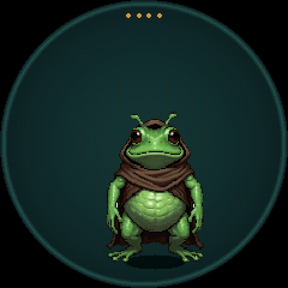
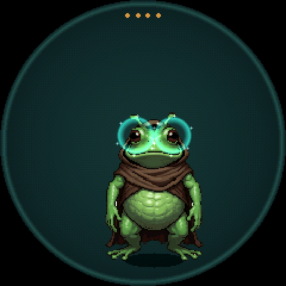
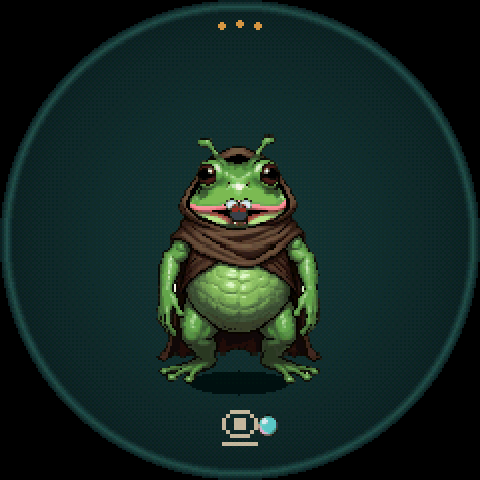
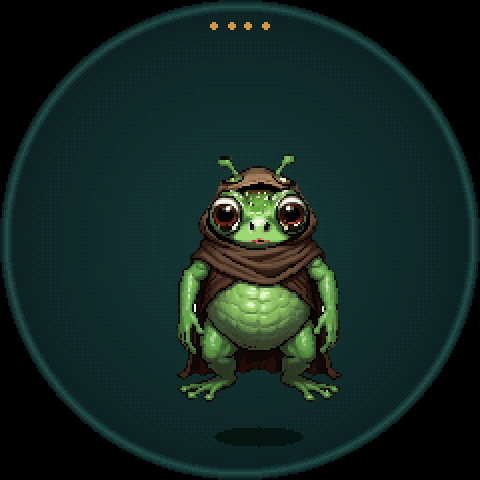
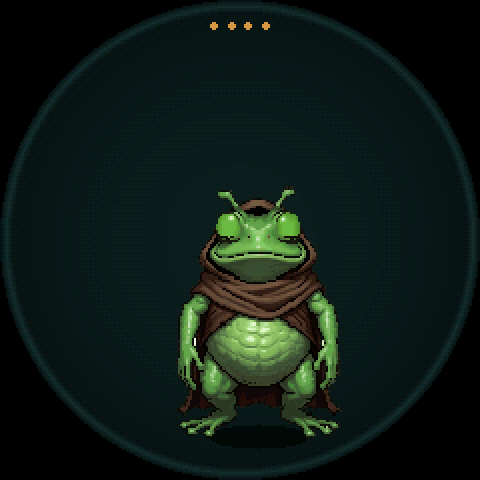
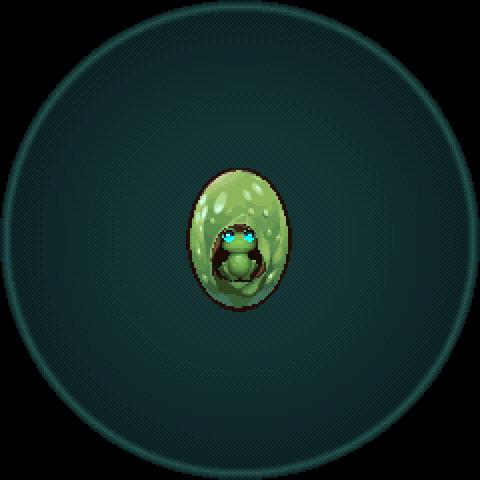
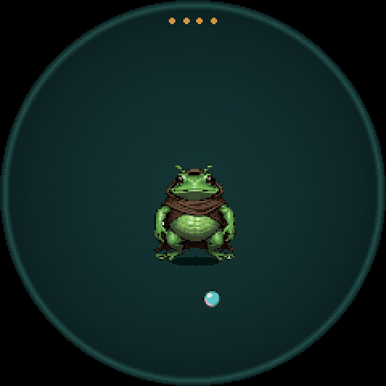
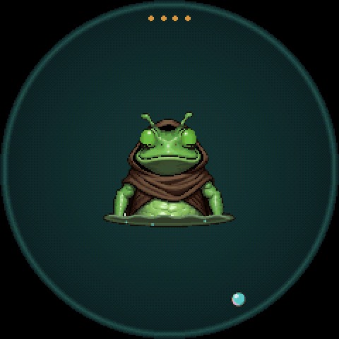
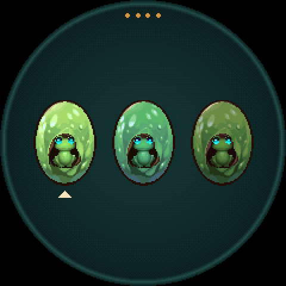
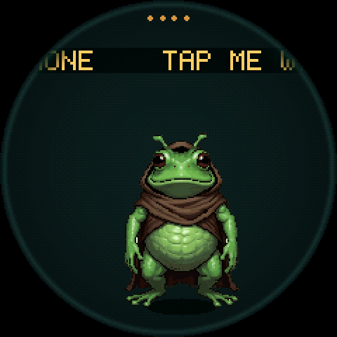

# What grungo can do

Grungo is a small hooded frog who lives in a round dish on the screen. You care for him with your hands, by tilting, tapping, shaking, holding and flipping the device. A phone is optional. It lets you look inside him and adds a few special twists.

This page lists everything he can do and everything you can do to him, as the code works today (`origin/engine`, commit `a1cb726`). Words in *italics* are defined in the [glossary](#glossary) at the end.



## Time runs in real hours

Grungo lives on his own *pet clock*. One pet hour is one real hour while the device has power. His night runs from 21:00 to 07:00 pet time.

- He thinks 5 times a second and his body updates 10 times a second.
- A whole life lasts about 10 days if nothing goes wrong.
- A phone visit sets his clock to your real time. Without a phone, his clock starts wherever it started, and you can shift it slowly (see [Face down](#everything-you-can-do-to-him)).

## His body and his dish

The screen is the dish. Everything in it is simulated.

| Thing | What it is | What you see |
|---|---|---|
| Grungo | The creature. | A green frog in a brown hooded cloak. |
| Pellet | One piece of food. | A fly lying in the dish. |
| Rotten pellet | A pellet left in the dish for more than 90 minutes. | A rotten fly. |
| Pantry | The store of pellets the button can drop. It holds 4 and refills one pellet every 2 hours. | Orange pips along the top of the rim, one per pellet. |
| Marble | A toy ball. There is always exactly one. | A small teal ball. |
| Rim | The edge of the dish. Pellets and the marble stop at it, and the marble bounces off it. | The ring around the screen. |
| Lid | Not an object. Turning the device face down is "putting the lid on". | Nothing, because the screen faces the table. |

**Tilt moves things.** Tilting the dish more than about 3 degrees rolls the marble downhill. It keeps rolling, slows with friction and bounces off the rim at half speed. Pellets slide downhill only while the tilt lasts, and stop when you level the dish.

**Pellets land at random.** A dropped pellet lands somewhere in the middle 60% of the dish. If the dish already holds 6 pellets, the oldest one is replaced.

## Everything you can do to him

The device has a motion sensor and one button (**BOOT** on the 1.28-inch board). Each gesture below is what the sensor code detects, and the effect is what the starter genome makes of it. A child's genes can change these effects.

| Gesture | How the device detects it | What it does to him |
|---|---|---|
| Press the button | Pressed and released in under 1.2 s. | Drops a pellet from the pantry. Nothing happens if the pantry is empty. |
| Hold the button | Held for 1.2 s. | "Tuck-in". Sleepiness +0.2. Does nothing while he is asleep. |
| Knock | One tap on the case. At most one counts every 0.4 s. | He flinches (hood up for 0.6 s). Fear +0.05, boredom -0.15. |
| Double knock | Two quick taps. | Boredom -0.25, loneliness -0.1. |
| Shake | 4 jolts of at least 0.55 g within 0.9 s. A second shake needs 0.6 s of calm first. | Adrenaline +0.6, discomfort +0.25, fear +0.3. The adrenaline usually makes him hop. |
| Pick up | The device tilts more than about 17 degrees for 0.4 s. He counts as "held" until it is level again for 1.5 s. | Need for touch -0.1, fear +0.05. |
| Cradle | Held, screen up and still for 3 s. It repeats every 10 s while you keep him still. | Need for touch -0.35, loneliness -0.2, fear -0.2. Works while he sleeps. |
| Tilt | Any lean of the dish. | Rolls the marble and slides pellets. Follow tilt and Flee tilt use it. |
| Flip | The screen turns to face down. | Discomfort +0.3, fear +0.15. |
| Face down for 2 s | Lid detection. Lasts until you turn him up for 0.2 s. A flip held for 2 s counts. | Melatonin +0.3, which makes him sleepy over the next half hour. To him it is now dark (his `light` feature is 0). Works while he sleeps. |
| Face down for 30+ min in daytime | The lid stays on past a nap. | Shifts his body clock by up to 1 hour per pet day. In the afternoon, night comes sooner. In the morning, dawn comes later. |
| Drop | About 5 cm of free fall, then a hard landing. | Injury +0.15, adrenaline +0.4, pain +0.3. About 6 drops in one day can kill him. |

Some gestures register but do nothing to him today, because no gene responds to them: putting him down, righting him after a flip, and lifting the lid.

**On an egg.** Holding the egg (or warming it in your hand) makes it hatch about a third sooner. Knocks do nothing to an egg today.

**On a clutch.** After he dies, the same gestures choose the next egg. See [Life cycle](#life-cycle).

## What he senses

His *brain* notices 20 things, called *features*. Each is a number from 0 (off) to 1 (fully on).

| Feature | On when |
|---|---|
| `motion` | The device is moving. |
| `held` | You hold him (tilted more than about 17 degrees). |
| `upside_down` | The screen faces down. |
| `light` | It is pet daytime and the lid is off. |
| `day_sin`, `day_cos` | Two numbers that together give the time of day. |
| `owner_near` | A phone is connected. |
| `asleep` | He is asleep. |
| `age` | Rises slowly over his life. |
| `food_near` | A pellet is close. 1 means he is on top of it. |
| `marble_near` | The marble is close. |
| `cradled` | You are cradling him. |
| recent `knock`, `shake`, `picked_up`, `cradle`, `fed`, `marble_hit`, `owner_arrived`, `petted` | That event just happened. The signal halves every 0.1 s, so it fades in under half a second. |

His body also senses things his brain does not see: the exact tilt, warmth from your hand, whether the nearest pellet is rotten, and how full the pantry is. Genes can react to these, but he cannot learn from them.

## His 11 actions

His brain picks one action at a time. Each action runs for at least its minimum time unless it finishes sooner. Then his brain picks again.

| Action | On screen | What it does | Min time |
|---|---|---|---|
| Rest | Stands still, breathing. | Nothing. | 2 s |
| Wander | Ambles in a random direction. Turns around at the rim. | Nothing, unless he walks into the marble. | 3 s |
| Eat | Walks to the nearest pellet, bites it and chews for 1.5 s with the fly in his mouth. | Hunger -0.4, boredom -0.05, food for energy. A rotten pellet also adds toxin +0.4 and discomfort +0.3. With no pellet in the dish, Eat stops at once. | 2 s |
| Sleep | Eyes closed, sleep pose. | He dreams (see [How he learns](#how-he-learns)). Sleep continues only while he is sleepy enough. | 30 s |
| Foresee | Stands still, eyes up. Teal rings glow around his eyes, with sparks when bright. | Boredom -0.2 every time. This is his signature: "grungo scries". | 4 s |
| Call | Stands in the call pose, croaking at you. | Nothing in his body today. | 2.5 s |
| Curl | Pulls his hood up and creeps slowly toward the rim. | Nothing by itself. | 4 s |
| Follow tilt | Walks downhill. Stands still on a level dish. | Can bring him to the marble. | 2 s |
| Flee tilt | Walks uphill, in the flee pose. | Nothing by itself. | 2 s |
| Chase | Walks after the marble and noses it on, so it rolls about half the dish. | Each time the marble reaches him, boredom -0.3. | 1.5 s |
| Hop circles | Happy hops in a circle, cloak flapping. | Nothing by itself. | 2 s |





### Two reflexes interrupt any action

A *reflex* takes over his body for a moment, then gives it back to the action.

- **Hop.** A rush of adrenaline (from a shake or a drop) makes him squash, leap and land, with an alarmed face. It lasts 1.2 s. Stronger adrenaline means a higher leap. Shaking him again while he is still full of adrenaline gives no new hop.
- **Flinch.** A knock makes him pull his hood up for 0.6 s.



## His 8 drives

A *drive* is a need, from 0 (satisfied) to 1 (desperate). Each one is a chemical in his body. It drifts back toward a resting level on its own, at the speed of its half-life, whether or not you are looking. His brain tries to lower whichever drives are high.

| Drive | Resting level, half-life | Raised by | Lowered by |
|---|---|---|---|
| Hunger | 0.15, 30 min | Low energy (energy runs down over hours) | Eating (-0.4) |
| Sleepiness | 0.10, 2 h | Darkness (night or the lid), button hold | Daylight, time |
| Boredom | 0.60, 1 h | Time | Foresee (-0.2), marble (-0.3), knock (-0.15), double knock (-0.25) |
| Loneliness | 0.50, 3 h | Time | Cradle (-0.2), double knock (-0.1), a phone arriving (-0.3) |
| Fear | 0.05, 2 min | Shake (+0.3), flip (+0.15), knock, pick up | Cradle (-0.2), time |
| Pain | 0.02, 10 min | Drop (+0.3), any injury | Time, as injury heals |
| Discomfort | 0.05, 5 min | Shake (+0.25), flip (+0.3), rotten food (+0.3) | Time |
| Need for touch | 0.50, 3 h | Time | Cradle (-0.35), pick up (-0.1) |

### Care hints teach you the toy

When he is awake and a drive passes 0.5, a small cream glyph appears at the bottom of the screen. It shows the gesture that helps most with his worst need.

| Worst need | Glyph |
|---|---|
| Hunger | The button (feed) |
| Need for touch or loneliness | Cradling hands |
| Boredom | A knock |
| Sleepiness | The lid (face down) |

The glyph gets brighter as the need gets worse.

## His face shows how he feels

He has 10 faces: neutral, happy, alarmed, annoyed, croak, blep, foresee, sleepy, asleep and yawn. Genes score each face from his drives. The face with the best score shows, and a new face must beat the current one clearly, so faces do not flicker. A reflex always shows the alarmed face.

The table below is worked out from the starter genes' numbers, not watched on screen.

| Face | Shows when (starter genes) |
|---|---|
| Neutral | Nothing else scores clearly higher. |
| Happy | Hunger, boredom and fear are all low. |
| Alarmed | Fear or discomfort is high, and during a reflex. |
| Annoyed | Discomfort or pain is high. |
| Blep (tongue out) | Hunger is above about 0.56. |
| Asleep (eyes shut) | Sleepiness is above about 0.47, even before he lies down to sleep. |
| Croak, foresee, sleepy, yawn | Never. Their genes cannot outscore neutral or asleep. A mutation can strengthen them. |

The screen also blinks him, bobs him and adds an occasional yawn on its own. The dish darkens toward midnight.



## Sleep and his body clock

At pet night, or under the lid, his `light` feature goes to 0. Darkness makes melatonin, and melatonin turns into sleepiness over about half an hour. Once he is sleepy enough, Sleep keeps running until his sleepiness falls again.

Nothing wakes him early. No gesture in the starter genome has the "wakes him" flag. In the e2e test runs he usually slept from about 23:00 to 10:00.

A *cradle*, the lid and a phone pet still reach him while he sleeps. Other gestures do nothing to his body until he wakes, but the button still drops pellets into the dish.

## How he learns

Grungo's brain is a table of guesses. Each guess answers one question: "When I notice *this* and do *that*, how much does *this need* change?" There is one guess for every feature, action and drive, so 20 × 11 × 8 = 1,760 guesses. The code calls each guess a *weight*, and the phone calls the strong ones *beliefs*.

**Choosing.** Every few seconds he scores each action. An action scores well when his guesses say it will lower the drives that are high right now. Two things blur the choice:

- Repeating an action makes it a little less attractive for a while (*habit*), so he varies what he does.
- A random amount is added to every score. Adrenaline adds more randomness.

**Learning.** When an action ends, he compares how his drives really changed with what he guessed. He moves his guesses part of the way toward what happened. Only the features that were on when that action *started* get the credit, and only that one action. An action that ran a long time counts for less.

So if he chases the marble and gets shaken, his guess for "chase raises fear" grows, and he chases less.

**Dreaming.** Asleep, he has one dream every 8 seconds. A dream either installs one *instinct* or replays one of the last 16 things he did, as if it happened again. After every dream, every guess shrinks a little toward zero. That is forgetting.

**Instincts.** An instinct is a guess written in his genes. A newborn gets his instincts in a burst of 12 dreams at hatching, so he knows to eat, sleep and curl before his first decision. More instincts switch on as he grows.

| Instinct | When it switches on |
|---|---|
| Near food, eating lowers hunger. | Hatching |
| At this time of day, sleeping lowers sleepiness. | Hatching |
| Just shaken or knocked, curling lowers fear. | Hatching |
| Cradled, resting lowers need for touch. | Hatching |
| In daytime, foreseeing lowers boredom. | Hatching |
| Near the marble, chasing lowers boredom. | Child |
| With a phone near, calling lowers loneliness. | Adult |
| Just fed, hopping in circles lowers boredom. | Adult |
| Just shaken, foreseeing lowers fear ("he foresaw the shake"). | Adult, once any ancestor earned the `dreamer` feat |

An instinct is installed once. After that, experience and forgetting wear it down like any other guess.

**Heirlooms.** When he dies, his 3 strongest beliefs can pass to his children as new instincts. A belief qualifies only if it moves a drive by at least 0.137. The phone shows these as "learned by gen N".

## Life cycle

One life is one run, as in a roguelite. The dish always holds exactly one of three things: an egg, a living grungo, or a clutch.

```
egg --hatch--> grungo --dies--> remains (30 min) --> clutch of 1 to 3 eggs --pick--> egg
```

### Egg

An egg hatches after 30 minutes on its own, or about 20 minutes if you keep holding it. It shakes in the last third. You can see the froglet inside, in his own colours.



### Growing up

His *life* chemical starts full and halves every 3 days. As it falls, his genes switch on each new *stage*.

| Stage | Starts at about | What changes |
|---|---|---|
| Baby | Hatching | Drawn small (about 55%). |
| Child | Day 0.5 | Still small. The marble-chasing instinct switches on. |
| Adult | Day 2 | Full size, a slightly larger build. Adult instincts switch on. Longer head stalks, if an ancestor reached elder. |
| Elder | Day 7.5 | Learns more slowly, forgets faster, explores less. |



### Death

He dies in one of three ways.

- **Old age.** Life runs out, at about day 10.
- **Starved.** Hunger stays above 0.8 for a long time. Starving also injures him, and injury makes him age faster.
- **Injured.** Injury reaches 0.9. Drops, rotten food and starving all add injury. It heals with a 6-hour half-life.

### Remains and the clutch

His remains lie in the dish for a 30-minute vigil. Then the eggs appear.



The clutch has 1 egg, plus 1 if he or any ancestor reached adult, plus 1 if he or any ancestor reached elder (3 at most). Each egg is his child with mutated genes. Every egg differs from its parent and from its siblings in its skin colour, and in at least one gene for how he reacts, learns or feels.

To choose an egg:

1. Press the button or knock to move the cursor to the next egg.
2. Hold the button or double knock to pick the egg under the cursor.

If you do nothing for 30 minutes, the egg under the cursor is picked. With only one egg, there is no choice.



### What carries to the next generation

Everything passes through the genes.

- **Mutation.** Genes change a little, change wildly, copy themselves or disappear. Sleeping (*dormant*) genes can wake. The starter genome carries three: a bluer cloak, a brighter seer glow, and a gene that makes him love being shaken.
- **Heirlooms.** His strongest beliefs, as described in [How he learns](#how-he-learns).
- **Feats.** Milestones any ancestor earned. They raise clutch size, add 2% wild mutation each, and switch on gated genes.

| Feat | Earned by a life that |
|---|---|
| `reached_adult` | Grew to adult. |
| `reached_elder` | Grew to elder. |
| `lived_a_week` | Lived 7 days. |
| `well_fed` | Ate at least 4 times per day lived. |
| `dreamer` | Dreamt 2,000 dreams. |
| `fifth_generation` | Was generation 5 or later. |

## Time while unplugged

When the device has no power, time can still pass for him, but only once the device learns how long it was off. Today a phone visit is the only way it learns the real time.

- Until it knows the time, the screen scrolls "TAP ME WITH YOUR PHONE" above his head.
- When the time arrives, the device fast-forwards the gap, up to 30 days. Hunger, illness and ageing advance, and he can die in the gap. His brain does not run, so he learns nothing and you cannot feed him.
- An egg can hatch in the gap. If he dies in the gap, the clutch waits for you to choose.



## What the phone adds

The phone is an extra. Every core loop works without it. It connects over Bluetooth (a serial cable in the simulator) and can do three things.

### Look inside him (inspection)

| Command | What it shows |
|---|---|
| `STATE` | What he is, all 8 drives, life, injury, glow, whether he is dreaming, the pantry, pellets in the dish, day or night, and whether the time is known. |
| `CHEM` | Every chemical in his body and its level. |
| `GENOME`, `GENE` | His genes, and the fields of one gene. |
| `BRAIN` | His learned beliefs. |
| `LINEAGE`, `ANCESTOR`, `DIFF`, `PORTRAIT` | The family tree, one ancestor, what changed between generations, and how an ancestor looked. |
| `CLUTCH` | Previews of the eggs. |
| `SUB` | A live feed of events. |

### Take a snapshot

`SNAPSHOT` sends his whole saved state: genes, chemistry, brain, body, dish and clock. The board does not change when you read it.

### Twists

A *twist* changes him through the phone. The board checks only that a twist is well formed. There are no other limits, except that plain food comes only from the button.

| Twist | What it does |
|---|---|
| `stimulus` | Fires an event as if he sensed it. Phone-only events: `petted` (need for touch -0.3, loneliness -0.15, works while asleep), `played` (boredom -0.3), `spoken_to` (loneliness -0.2). The phone cannot fire `button` or `fed`. |
| `prophecy_treat` | Special food "baked from the phone's futures". His vision chemical rises by 0.5, so his eyes glow as if foreseeing. It does not feed him. |
| `prophecy` | Sets one of his beliefs to a value you choose. |
| `gene_edit` | Changes one byte of one gene. The lineage records the edit. |
| `rename` | Renames the line (1 to 15 letters, digits, `_` or `-`). |
| `pick` | Picks a clutch egg. |

Connecting a phone also counts as the owner arriving (loneliness -0.3), and turns on his `owner_near` feature. `TIME` sets his clock to your real time.

## Known limits today

This section is the current state at commit `a1cb726`, measured in two simulator studies (40 paired seeds each). Agents are working on fixes, so expect it to change.

- **Lessons fade overnight.** Each night's forgetting takes about 0.14 off every belief. No lesson he forms in one day is bigger than that. Shaking him every time he chases the marble cut chasing from 6.4% of his waking time to 0.2% the same day. The next morning it was back to 6.4%.
- **Rewards rarely teach him.** Foresee lowers boredom every time, and he picks it so often that boredom sits near 0 all day. A need at 0 cannot fall, so play, the marble, knocks and cuddles teach him nothing. Punishment works, because a shake creates the fear it then teaches.
- **He barely notices a gesture.** A knock or a shake is visible to his brain for about half a second. He decides every 2 to 4 seconds, and gestures do not interrupt him.
- **The hop never changes.** He hops at every shake and is just as scared on day 4 as on day 1.
- **He cannot anticipate meals.** Eat with no pellet stops at once, so waiting for food at the usual hour never pays.
- **He cannot learn that rot is bad.** He does not see whether a pellet is rotten, and a rotten pellet still eases his hunger.
- **Nights are hungry.** Nothing wakes him when hungry. A pellet dropped while he sleeps rots in 90 minutes, and he eats it on waking. In the tests, feeding him from 07:00 every 3 hours starved him at about 34 hours. Feeding him at 11:00, 13:30, 16:00, 18:30 and 21:00 kept him alive.
- **A lid left past dawn moves his clock the wrong way.** Face down from 19:00 to 09:00 made his day start 2 hours later by day 4. Face down from 19:00 to 23:00 made him sleep earlier, as intended.
- **No heirloom has ever passed on.** In every measured life, no belief at death was strong enough, so children start with only the starter instincts.
- **Call does nothing yet.** No gene responds to it.
- **Board build pending.** Grungo runs in the simulator today. The real board's screen, storage and Bluetooth arrive in the next build unit.

## Glossary

**Action.** One of the 11 things his brain can choose to do, such as Eat or Chase.

**Belief.** A learned guess that is strong enough to show on the phone. Same thing as a *weight*.

**BOOT.** The button on the 1.28-inch board. Press it to feed him.

**Care hint.** The glyph at the bottom of the screen that shows which gesture helps his worst need.

**Chemical.** A number from 0 to 1 in his body that rises and decays over time. Drives, life, injury, adrenaline and melatonin are all chemicals.

**Clutch.** The 1 to 3 eggs he leaves after death. You pick one to continue the line.

**Cradle.** Holding him screen up and still for 3 seconds. It repeats every 10 seconds while you keep holding.

**Double knock.** Two quick taps on the case.

**Dormant gene.** A gene he carries that does nothing until a mutation wakes it.

**Dream.** One step of learning while asleep, every 8 seconds. It replays a recent moment or installs an instinct.

**Drive.** A need, such as hunger or fear, from 0 to 1. His brain acts to lower high drives.

**Feat.** A milestone a life earns, such as reaching elder. Feats earned by any ancestor unlock bigger clutches and gated genes.

**Feature.** One of the 20 things his brain notices, such as `food_near` or "just shaken".

**Foresee.** His signature action. He stands still and his eyes glow teal, as if seeing the future.

**Gene.** One instruction in his genome, such as "a shake adds adrenaline" or "the cloak is brown".

**Genome.** All his genes. It is the only description of him, and children inherit it with mutations.

**Habit.** A short-lived penalty on an action he just picked, so he does not repeat it forever.

**Heirloom.** A belief strong enough at death to become an instinct in his children.

**Instinct.** A guess written in his genes and installed while he dreams, so he knows some things without learning them.

**Lid.** Turning the device face down. It makes his dish dark and helps him sleep.

**Life.** The chemical that measures how much life he has left. It halves every 3 days.

**Lineage.** The family line: every generation, its genes and how each life ended.

**Marble.** The toy ball in the dish. Tilt rolls it, and he chases it.

**Mid-call.** Older notes say "picked up mid-call". It means "while he was doing the Call action".

**Mutation.** A random change to a gene when an egg is made.

**Pantry.** The store of pellets the button drops from. It holds 4 and refills one every 2 hours. The orange pips on the rim show it.

**Pellet.** One piece of food, drawn as a fly. It rots after 90 minutes in the dish.

**Pet clock.** His own clock. It runs at real speed and can be set by a phone or shifted by the lid.

**Prophecy.** A twist that sets one of his beliefs directly.

**Recent (feature).** A feature that turns on when an event happens and fades within half a second, such as "recent shake".

**Reflex.** An automatic movement, a hop or a flinch, that takes over his body for a moment.

**Remains.** His body after death, shown for a 30-minute vigil before the eggs appear.

**Rim.** The edge of the dish.

**Snapshot.** His whole saved state, which the phone can read.

**Stage.** Baby, child, adult or elder. Each stage switches on new genes.

**Stimulus.** A detected event, such as a knock, a shake or a bite of food. His genes decide what each stimulus does to him.

**Tuck-in.** Holding the button. It makes him a little sleepier.

**Twist.** A change the phone makes to him, such as a special treat or a renamed line.

**Vigil.** The 30 minutes his remains stay in the dish before the clutch appears.

**Weight.** One number in his brain's table of guesses. It says how much one drive changes when he does one action while noticing one feature.
